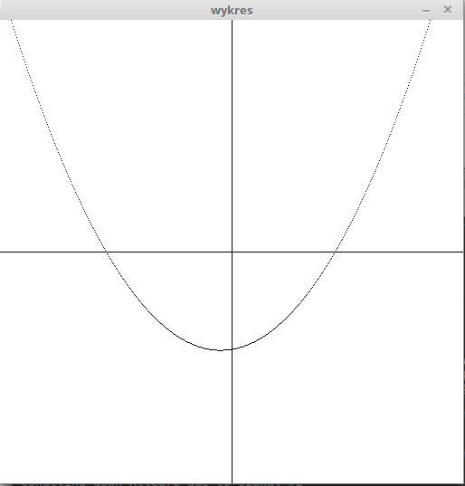

# x86

Program napisany w języku asemblera architektury Intel x86. Rysyje funkcję kwadratową ax^2+bx+c i umożliwia zmianę parametrów za pomocą klawiszy:

A: zwiększa a, S: zmniejsza a

B: zwiększa b, N: zmniejsza b

C: zwiększa c, V: zmniejsza c

